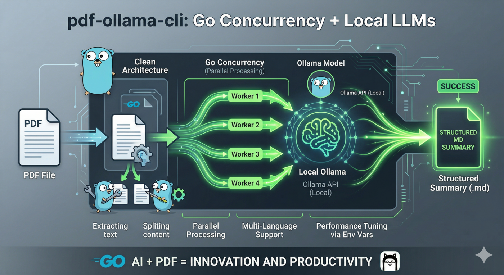

# pdf-ollama-cli



`pdf-ollama-cli` is a Go command-line application that extracts text from a PDF, summarizes the content in parallel with Ollama, and produces a final consolidated summary.

The project is intentionally structured with clear separation between application logic, infrastructure adapters, and runtime configuration so it can evolve beyond a simple script.

## Table of Contents

- [What it does](#what-it-does)
- [Architecture](#architecture)
- [Project structure](#project-structure)
- [Requirements](#requirements)
- [Installation](#installation)
- [Configuration](#configuration)
- [Running the program](#running-the-program)
- [Build](#build)
- [Testing](#testing)
- [Operational notes](#operational-notes)
- [Troubleshooting](#troubleshooting)
- [Roadmap](#roadmap)

## What it does

The application executes a two-pass summarization workflow:

1. Extract text from a PDF using `pdftotext`.
2. Split the text into chunks.
3. Process those chunks concurrently against Ollama.
4. Merge the intermediate summaries.
5. Generate a final summary with an executive structure.

This approach makes large documents more manageable and improves total processing time compared to a fully sequential summarization flow.

## Architecture

The codebase follows a layered architecture.

- `main.go`
	Application entrypoint and dependency composition root.
- `config/`
	Runtime configuration loading from environment variables.
- `internal/app/summarizer/`
	Core use case and orchestration of the summarization pipeline.
- `internal/infra/pdf/`
	Adapter for PDF text extraction via `pdftotext`.
- `internal/infra/ollama/`
	Adapter for Ollama HTTP API communication.

### Design goals

- Keep business flow isolated from infrastructure details.
- Allow adapters to be replaced independently.
- Support unit testing of the application service through interfaces.
- Keep `main` small and focused on wiring only.

### Dependency direction

- `main` depends on `config`, `internal/app`, and `internal/infra`.
- `internal/app` depends on ports/interfaces, not concrete adapters.
- `internal/infra` provides concrete implementations for those ports.

## Project structure

```text
.
├── config/
│   ├── config.go
│   └── config_test.go
├── internal/
│   ├── app/
│   │   └── summarizer/
│   │       ├── service.go
│   │       └── service_test.go
│   └── infra/
│       ├── ollama/
│       │   ├── client.go
│       │   └── client_test.go
│       └── pdf/
│           ├── extractor.go
│           └── extractor_test.go
│       └── terminal/
│           ├── renderer.go
│           └── renderer_test.go
├── main.go
├── main_test.go
├── go.mod
└── README.md
```

## Requirements

To run the project locally you need:

- Go `1.25` or newer (Go `1.26` recommended for security).
- Ollama installed and reachable from the configured URL.
- A model available in Ollama.
- `pdftotext` installed and available in `PATH`, unless overridden with `PDFTOTEXT_BIN`.

### Runtime dependencies

- Ollama API compatible with `POST /api/generate`.
- A supported PDF file that can be processed by `pdftotext`.

### Install `pdftotext` on Linux

```bash
sudo apt-get update
sudo apt-get install -y poppler-utils
```

### Check local tooling

```bash
go version
ollama --version
pdftotext -v
```

## Installation

Clone the repository and download dependencies:

```bash
git clone https://github.com/jonathanbrenman/pdf-ollama-cli
cd pdf-ollama-cli
go mod download
```

Pull or verify the Ollama model you want to use:

```bash
ollama pull gemma4:e4b
```

If Ollama is local, start the service before running the CLI.

## Configuration

Configuration is read from environment variables and uses defaults when no explicit value is provided.

| Variable | Default | Description |
| --- | --- | --- |
| `CHUNK_SIZE` | `2000` | Approximate number of characters processed per chunk |
| `NUM_WORKERS` | `4` | Number of concurrent workers used for chunk summarization |
| `OLLAMA_MODEL` | `gemma4:e4b` | Model name sent to Ollama |
| `OLLAMA_URL` | `http://localhost:11434` | Base URL for the Ollama server |
| `PDFTOTEXT_BIN` | `pdftotext` | Binary name or absolute path for PDF extraction |
| `HTTP_TIMEOUT_SECONDS` | `120` | Timeout used by the HTTP client when calling Ollama |

### CLI flags

| Flag | Default | Description |
| --- | --- | --- |
| `--language` | `Spanish` | Language requested for the generated final summary |
| `--lang` | `Spanish` | Alias for `--language` |

### Example configuration

```bash
export OLLAMA_URL="http://localhost:11434"
export OLLAMA_MODEL="gemma4:e4b"
export NUM_WORKERS=6
export CHUNK_SIZE=3000
export HTTP_TIMEOUT_SECONDS=180
```

## Running the program

The CLI expects exactly one positional argument: the path to a PDF file.

The output language can be controlled with a CLI flag.

### Run directly with Go

```bash
go run . /path/to/document.pdf
```

### Run with an explicit output language

```bash
go run . --language English /path/to/document.pdf
```

```bash
go run . --lang Portuguese /path/to/document.pdf
```

### Build first, then run the binary

```bash
go build -o bin/pdf-ollama-cli .
./bin/pdf-ollama-cli --language English /path/to/document.pdf
```

### CLI usage

```bash
pdf-ollama-cli [--language <language>] <file.pdf>
```

### Example

```bash
export OLLAMA_MODEL="gemma4:e4b"
go run . --language English ./sample.pdf
```

### Expected behavior

- The final summary is printed to standard output.
- When terminal rendering is available, the Markdown response is rendered with terminal styling.
- Errors are printed to standard error.
- On failure, the process exits with a non-zero status code.

## Build

Build all packages:

```bash
go build ./...
```

Build a distributable binary:

```bash
mkdir -p bin
go build -o bin/pdf-ollama-cli .
```

Useful verification commands:

```bash
go fmt ./...
go vet ./...
go build ./...
```

## CI/CD Pipeline

The project includes a GitHub Actions pipeline (`.github/workflows/ci.yml`) that automatically runs on every push and pull request to `main` or `master`. It performs the following checks:

- **Linter**: Uses `golangci-lint` to ensure code quality.
- **Security Scan**: Uses `govulncheck` to identify vulnerabilities in the standard library and dependencies.
- **Tests & Coverage**: Executes the full test suite and enforces a minimum **80% code coverage** threshold.

## Testing & Quality Control

Run the full test suite:

```bash
go test ./...
```

Run tests with coverage:

```bash
go test -coverprofile=coverage.out ./...
go tool cover -func=coverage.out
```

### Run security scan locally

```bash
go install golang.org/x/vuln/cmd/govulncheck@latest
govulncheck ./...
```

### Run linter locally

```bash
# Requires golangci-lint installed
golangci-lint run ./...
```

Current test coverage is organized by package:

- `config`: configuration loading behavior.
- `internal/app/summarizer`: summarization service behavior.
- `internal/infra/ollama`: Ollama client behavior.
- `internal/infra/pdf`: PDF extractor behavior.
- `internal/infra/terminal`: Markdown rendering and sanitization behavior.
- `main`: CLI argument parsing behavior.

Run tests with verbose output:

```bash
go test -v ./...
```

Run tests with coverage:

```bash
go test -cover ./...
```

Run tests for a single package:

```bash
go test ./internal/app/summarizer
```

## Operational notes

- Large PDFs may require tuning `CHUNK_SIZE` and `NUM_WORKERS` to balance latency, memory usage, and model response quality.
- Increasing workers can improve throughput, but it also increases pressure on the Ollama instance.
- Very small chunk sizes can degrade summary coherence.
- Very large chunk sizes can exceed model comfort limits or increase latency significantly.
- The final output is emitted as Markdown and rendered for terminal display when the renderer is available.

## Troubleshooting

### `run pdftotext: ...`

Cause:
The extractor binary is missing or not reachable.

Action:

```bash
sudo apt-get install -y poppler-utils
```

Or point `PDFTOTEXT_BIN` to the correct binary path.

### `send request: ...`

Cause:
The CLI cannot reach Ollama.

Action:

- Verify that Ollama is running.
- Verify `OLLAMA_URL`.
- Check firewall, container, or host-network restrictions if Ollama is remote.

### `ollama returned status ...`

Cause:
Ollama rejected the request.

Action:

- Confirm the configured model exists.
- Confirm the server supports the requested endpoint.
- Review Ollama logs for resource or model errors.

### Empty or poor summaries

Cause:
Input chunking and model selection are not aligned with the document.

Action:

- Increase `CHUNK_SIZE` for more context per request.
- Reduce `NUM_WORKERS` if the Ollama instance is saturated.
- Try a stronger or better-suited model.
